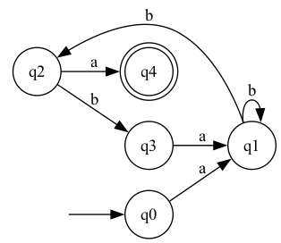
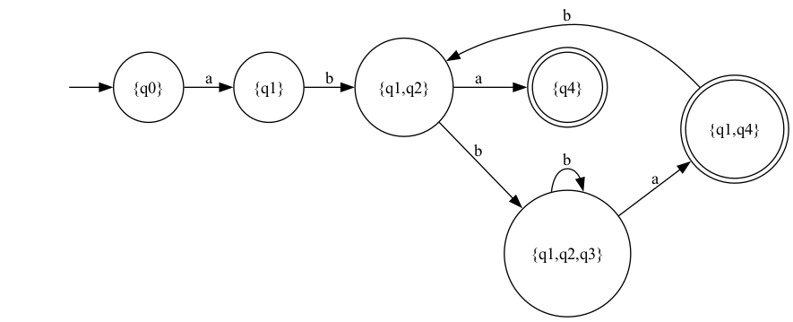

# Formal Languages & Finite Automata - Laboratory Works

This repository contains laboratory works for the **Formal Languages & Finite Automata** course.

**Author:** Ciocanu Ilinca  
**University:** Technical University of Moldova  
**Academic Year:** 2025-2026

---

## 📚 Course Information

**Course:** Formal Languages & Finite Automata  
**Instructor:** Cretu Dumitru (with Vasile Drumea and Irina Cojuhari)

---

## 📂 Repository Structure

```
FLFA-Labs/
├── README.md                 # This file
├── lab1/                     # Laboratory Work #1
│   ├── src/
│   │   ├── grammar.py       # Grammar class implementation
│   │   ├── finite_automaton.py  # Finite Automaton class
│   │   └── main.py          # Main demonstration program
│   └── report/
│       └── REPORT.md        # Lab 1 report


├── lab2/                     # Laboratory Work #2
│   ├── grammar.py       # Grammar class with Chomsky classification
│   ├── finite_automaton.py  # FA with NFA→DFA conversion
│   ├── main.py          # Main demonstration program
│   ├── variant6_nfa.png 
│   ├── variant6_dfa.png 
│   ├── variant6_nfa.dot 
│   └── variant6_dfa.dot
│   └── report2.md      # Lab 2 report
│         
├── lab3/                     # Laboratory Work #3 (future)
└── ...
```

---

## 🎯 Laboratory Works

### Lab 1: Regular Grammars and Finite Automata
**Status:** ✅ Completed  
**Variant:** 6

**Objectives:**
- Implement a Grammar class to represent formal grammars
- Generate valid strings from grammar productions
- Convert Grammar to Finite Automaton
- Validate strings using the Finite Automaton

**Key Features:**
- Support for non-deterministic finite automata (NFA)
- Random string generation using derivation
- Comprehensive string validation

**Variant 6 Grammar:**
```
V_N = {S, I, J, K}
V_T = {a, b, c, e, n, f, m}
Productions:
    S → cI
    I → bJ | fI | eK | e
    J → nJ | cS
    K → nK | m
```

[📄 View Lab 1 Report](./lab1/report/REPORT.md)

---

### Lab 2: Determinism in Finite Automata
**Status:** ✅ Completed  
**Variant:** 6

**Objectives:**
- Classify grammars according to Chomsky hierarchy
- Convert Finite Automaton to Regular Grammar
- Determine if FA is deterministic or non-deterministic
- Implement NFA to DFA conversion (subset construction)
- Generate graphical representations of automata

**Key Features:**
- **Chomsky hierarchy classification** (Types 0-3)
- **Determinism detection** algorithm
- **NFA to DFA conversion** using subset construction
- **Graphviz visualization** for both NFA and DFA
- **13 comprehensive unit tests** with 100% pass rate

**Key Results:**
- ✅ Variant 6 FA is **non-deterministic** (NFA)
- ✅ Successfully converted 5-state NFA to 6-state DFA
- ✅ Non-determinism caused by δ(q1, b) = {q1, q2}

**Variant 6 Automaton:**
```
Q = {q0, q1, q2, q3, q4}
Σ = {a, b}
F = {q4}
Transitions:
    δ(q0, a) = q1
    δ(q1, b) = q1, q2  ← Non-deterministic!
    δ(q2, a) = q4
    δ(q2, b) = q3
    δ(q3, a) = q1
```

[📄 View Lab 2 Report](./lab2/report/REPORT.md)

---

## 🚀 How to Run

### Prerequisites
- Python 3.8 or higher
- Graphviz (optional, for Lab 2 visualization)
  ```bash
  # Ubuntu/Debian
  sudo apt-get install graphviz
  
  # macOS
  brew install graphviz
  
  # Windows
  # Download from https://graphviz.org/download/
  ```

### Running Lab 1

```bash
# Navigate to lab1 directory
cd lab1/src

# Run the main program
python main.py
```

**Expected Output:**
The program will:
1. Display the grammar definition
2. Generate 5 random valid strings
3. Show the converted Finite Automaton
4. Validate generated strings and test cases

---

### Running Lab 2

```bash
# Navigate to lab2 directory
cd lab2/src

# Run the main demonstration
python main.py

# Run unit tests
python test_automata.py

# Generate visualizations (requires Graphviz)
cd ../visualizations
dot -Tpng variant6_nfa.dot -o variant6_nfa.png
dot -Tpng variant6_dfa.dot -o variant6_dfa.png
```

**Expected Output:**
The program will:
1. Classify a grammar using Chomsky hierarchy
2. Analyze the Variant 6 FA for determinism
3. Convert FA to regular grammar
4. Convert NFA to DFA using subset construction
5. Generate DOT files for visualization
6. Display comparison of NFA vs DFA (5 states → 6 states)

---

## 💻 Implementation Details

### Programming Language
**Python** was chosen for its:
- Clear and readable syntax
- Excellent built-in data structures (sets, dictionaries, defaultdict)
- Easy setup and execution
- Strong support for object-oriented programming
- Comprehensive standard library (collections, deque)

### Technologies Used
- **Python 3.8+**
- **Type hints** for better code documentation
- **Object-oriented design** patterns
- **Graphviz** for automata visualization
- **unittest** framework for comprehensive testing
- **Collections library** (defaultdict, deque) for efficient algorithms

### Algorithms Implemented

**Lab 1:**
- Random string generation via derivation
- NFA string validation with backtracking
- Grammar to FA conversion

**Lab 2:**
- **Chomsky hierarchy classification** algorithm
- **Subset construction** (NFA → DFA conversion)
- **Determinism detection** algorithm
- FA to regular grammar conversion
- Graph generation in DOT format

---

## 📊 Testing

### Lab 1
- Manual testing with multiple test cases
- Validation of generated strings
- Edge case handling

### Lab 2
- **13 unit tests** covering all functionality
- **100% test pass rate**
- Test categories:
  - Grammar classification (Types 0-3)
  - DFA/NFA detection
  - FA to grammar conversion
  - NFA to DFA conversion
  - Graphviz generation
  - Variant-specific functionality

```bash
# Run Lab 2 tests
cd lab2/src
python test_automata.py

# Output:
# Ran 13 tests in 0.001s
# OK ✓
```

---

## 📈 Visualizations (Lab 2)

### NFA Visualization


- Shows non-deterministic transition: q1 →(b)→ {q1, q2}
- 5 states with simple structure
- Double circle indicates final state (q4)

### DFA Visualization


- Compound states like {q1,q2} from subset construction
- 6 states with fully deterministic transitions
- Two final states: {q4} and {q1,q4}

**View online:** Copy `.dot` file contents to https://dreampuf.github.io/GraphvizOnline/

---

## 📖 Learning Outcomes

Through these laboratory works, I have learned:

### Theoretical Concepts
- Theory of formal languages and grammars
- **Chomsky hierarchy** and grammar classification
- Regular expressions and regular languages
- Deterministic vs non-deterministic automata
- Equivalence between different formal models

### Practical Skills
- Implementation of regular grammars and finite automata
- **Subset construction algorithm** for NFA to DFA conversion
- Algorithm design for string generation and validation
- Graph theory and visualization techniques
- Software testing with unit tests
- Documentation and technical writing

### Software Engineering
- Clean code principles
- Object-oriented design patterns
- Comprehensive testing strategies
- Version control best practices
- Technical documentation

---

## 🔍 Key Algorithms

### Subset Construction (NFA → DFA)
```
1. Start with initial state {q0}
2. For each unmarked state set S and symbol a:
   - Compute T = union of δ(q,a) for all q in S
   - Add T to DFA states if new
   - Create transition S →(a)→ T
3. Mark S as processed
4. Repeat until all states marked
5. Final states = sets containing NFA final states
```

### Chomsky Classification
```
Type 3 (Regular):     A → aB or A → a
Type 2 (Context-Free): A → α (single non-terminal left)
Type 1 (Context-Sensitive): αAβ → αγβ (non-contracting)
Type 0 (Unrestricted): No restrictions
```

---

## 🎓 Academic Integrity

This repository represents original work completed as part of university coursework. The implementations follow academic guidelines and are intended for educational purposes.

---

## 📧 Contact

**Ciocanu Ilinca**  
Technical University of Moldova  
Academic Year: 2025-2026

---

## 📄 License

This project is created for educational purposes as part of university coursework.

---

## 🙏 Acknowledgments

- **Instructors:** Cretu Dumitru, Vasile Drumea, Irina Cojuhari for excellent course materials
- **Graphviz community** for powerful visualization tools
- **Classic textbooks:** Hopcroft, Motwani & Ullman; Sipser for theoretical foundations

---

**Last Updated:** February 2026