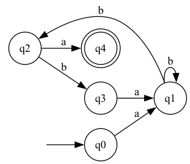
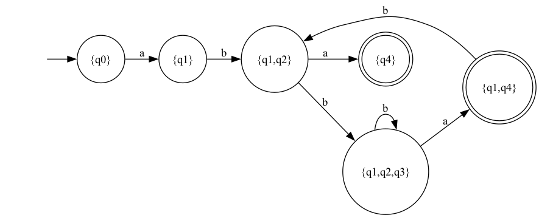

# Formal Languages & Finite Automata - Laboratory Works

This repository contains laboratory works for the **Formal Languages & Finite Automata** course.

**Author:** Ciocanu Ilinca  
**University:** Technical University of Moldova  
**Academic Year:** 2025-2026

---

## 📚 Course Information

**Course:** Formal Languages & Finite Automata  
**Instructor:** Cretu Dumitru (with Vasile Drumea and Irina Cojuhari)

---

## 📂 Repository Structure

```
FLFA-Labs/
├── LICENSE
├── README.md
├── lab1/
│   ├── report/
│   │   └── Report.MD
│   └── src/
│       ├── finite_automaton.py
│       ├── grammar.py
│       └── main.py
├── lab2/
│   ├── finite_automaton.py
│   ├── grammar.py
│   ├── main.py
│   ├── report2.MD
│   ├── variant6_dfa.dot
│   ├── variant6_dfa.png
│   ├── variant6_nfa.dot
│   └── variant6_nfa.png
├── lab3/
│   ├── constants.py
│   ├── lexer.py
│   ├── main.py
│   ├── raport/
│   │   └── report_lab3.md
│   └── tokens.py
├── lab4/
│   ├── ast_def.py
│   ├── main.py
│   ├── regex_generator.py
│   ├── regex_parser.py
│   └── report4/
│       └── lab4_report.md
├── lab5/
│   ├── cnf_normalizer.py
│   ├── main.py
│   ├── report5/
│   │   └── lab5_report.md
│   └── test_cnf.py
└── lab6/
    ├── ast_nodes.py
    ├── lexer.py
    ├── main.py
    ├── parser.py
    ├── pretty_print.py
    ├── report6/
    │   └── lab6_report.md
    ├── test_parser.py
    └── tokens.py
```

---

## 🗂️ Quick Lab Summaries

| Lab | Topic | Quick summary |
|---|---|---|
| Lab 1 | Regular Grammars and Finite Automata | Builds a regular grammar, generates valid strings, converts it to a finite automaton, and checks language membership. |
| Lab 2 | Determinism in Finite Automata | Classifies grammars, converts FA to regular grammar, detects NFA vs DFA, and applies subset construction. |
| Lab 3 | Lexer & Scanner | Implements a hand-written lexer for a small DSL with keywords, literals, operators, comments, and edge-case handling. |
| Lab 4 | Regular Expression Generation | Parses regular expressions into an AST and generates valid strings from the expression tree with tracing support. |
| Lab 5 | Chomsky Normal Form | Normalizes a context-free grammar into CNF through epsilon, unit, inaccessible, and non-productive symbol elimination. |
| Lab 6 | Parser & AST Construction | Extends the DSL with parsing support and builds an abstract syntax tree for statements, expressions, and blocks. |

---

## 🎯 Laboratory Works

### Lab 1: Regular Grammars and Finite Automata
**Status:** ✅ Completed  
**Variant:** 6

**Objectives:**
- Implement a Grammar class to represent formal grammars
- Generate valid strings from grammar productions
- Convert Grammar to Finite Automaton
- Validate strings using the Finite Automaton

**Key Features:**
- Support for non-deterministic finite automata (NFA)
- Random string generation using derivation
- Comprehensive string validation

**Variant 6 Grammar:**
```
V_N = {S, I, J, K}
V_T = {a, b, c, e, n, f, m}
Productions:
    S → cI
    I → bJ | fI | eK | e
    J → nJ | cS
    K → nK | m
```

[📄 View Lab 1 Report](./lab1/report/Report.MD)

---

### Lab 2: Determinism in Finite Automata
**Status:** ✅ Completed  
**Variant:** 6

**Objectives:**
- Classify grammars according to Chomsky hierarchy
- Convert Finite Automaton to Regular Grammar
- Determine if FA is deterministic or non-deterministic
- Implement NFA to DFA conversion (subset construction)
- Generate graphical representations of automata

**Key Features:**
- **Chomsky hierarchy classification** (Types 0-3)
- **Determinism detection** algorithm
- **NFA to DFA conversion** using subset construction
- **Graphviz visualization** for both NFA and DFA
- **13 comprehensive unit tests** with 100% pass rate

**Key Results:**
- ✅ Variant 6 FA is **non-deterministic** (NFA)
- ✅ Successfully converted 5-state NFA to 6-state DFA
- ✅ Non-determinism caused by δ(q1, b) = {q1, q2}

**Variant 6 Automaton:**
```
Q = {q0, q1, q2, q3, q4}
Σ = {a, b}
F = {q4}
Transitions:
    δ(q0, a) = q1
    δ(q1, b) = q1, q2  ← Non-deterministic!
    δ(q2, a) = q4
    δ(q2, b) = q3
    δ(q3, a) = q1
```

[📄 View Lab 2 Report](./lab2/report2.MD)

---

### Lab 3: Lexer & Scanner
**Status:** ✅ Completed

**Objectives:**
- Understand the role of lexical analysis in language processing
- Gain familiarity with the internal mechanics of a scanner
- Design and implement a lexer for a non-trivial DSL covering function declarations, control flow, collection literals, Boolean logic, and comments
- Demonstrate the lexer on representative input and verify behaviour on edge cases including malformed input

**DSL Features:**
The lexer targets a small general-purpose scripting language. A sample program illustrating all supported constructs:

```
# Fibonacci — recursive function demo
fn fib(n)
  if n <= 1
    return n
  end
  return fib(n - 1) + fib(n - 2)
end

let result = fib(10)
print result

let primes = [2, 3, 5, 7, 11]
let config = { "host": "localhost", "port": 8080 }

let x = 3.14
let flag = x > 2.0 and not false
```

| Construct | Syntax |
|---|---|
| Variable binding | `let x = 3.14` |
| Arithmetic | `+`, `-`, `*`, `/`, `%` |
| Boolean logic | `and`, `or`, `not` |
| Comparison | `==`, `!=`, `<`, `>`, `<=`, `>=` |
| Control flow | `if / else / end`, `while / end` |
| Functions | `fn name(params) … end` |
| Arrays | `[1, 2, 3]` |
| Maps | `{"key": value}` |
| Strings | `"hello\nworld"` (with escape sequences) |
| Comments | `# single-line` |

**Key Results:**
- ✅ Sample program (31 lines) correctly tokenised into **142 tokens**
- ✅ All six comparison operators correctly lexed, including two-character forms
- ✅ Integer and float literals correctly distinguished
- ✅ String escape sequences processed
- ✅ Unterminated string literals raise `LexerError` with accurate line and column

**Token types defined:**
```python
class TT(Enum):
    INTEGER, FLOAT, STRING, BOOL       # Literals
    IDENT                              # Identifiers
    LET, FN, RETURN, IF, ELSE         # Keywords
    WHILE, END, PRINT, AND, OR        #
    NOT, TRUE, FALSE                   #
    PLUS, MINUS, STAR, SLASH, PERCENT # Arithmetic
    EQ, NEQ, LT, GT, LTE, GTE        # Comparison
    ASSIGN                             # =
    LPAREN, RPAREN, LBRACKET          # Delimiters
    RBRACKET, LBRACE, RBRACE          #
    COMMA, COLON, NEWLINE             #
    COMMENT, EOF, UNKNOWN             # Special
```

[📄 View Lab 3 Report](./lab3/raport/report_lab3.md)

---

### Lab 4: Regular Expression Generation
**Status:** ✅ Completed  
**Variant:** 2

**Objectives:**
- Parse regular expressions dynamically at runtime
- Build an Abstract Syntax Tree (AST) representation of each regex
- Generate valid strings that belong to the described regular language
- Validate generated strings against Python regex matching
- Provide a step-by-step processing trace for generation (bonus)

**Key Features:**
- **Recursive-descent regex parser** with precedence handling
- **AST-based generation** using literals, concatenation, alternation, and quantifiers
- **Unicode superscript quantifier support** (`²`, `³`, etc.)
- **Configurable cap for unbounded repetition** (`*`, `+`) to avoid infinite generation
- **Generation trace logging** for explainable output

**Key Results:**
- ✅ Generated and validated 10 unique samples per regex variant
- ✅ Correct handling of optional, exact, one-or-more, and zero-or-more quantifiers
- ✅ Correct interpretation of alternation groups and nested expressions
- ✅ All generated strings validated with `re.fullmatch`

**Variant 2 Regex Set:**
```
1) M?N²(O|P)³Q*R*
2) (X|Y|Z)³8⁺(9|0)
3) (H|i)(J|K)L*N?
```

[📄 View Lab 4 Report](./lab4/report4/lab4_report.md)

---

### Lab 5: Chomsky Normal Form (CNF)
**Status:** ✅ Completed  
**Variant:** 6

**Objectives:**
- Implement a reusable CFG normalization pipeline to CNF
- Apply the full transformation sequence to Variant 6 grammar
- Display intermediate grammars after every normalization stage
- Verify that the final grammar satisfies strict CNF constraints
- Support generic grammars beyond the assignment-specific input (bonus)

**Key Features:**
- **Epsilon-production elimination** via nullable-symbol fixpoint computation
- **Unit-production elimination** using transitive unit-closure
- **Inaccessible and non-productive symbol elimination**
- **Strict CNF conversion** with terminal lifting and rule binarization
- **Step-by-step normalization trace** and final CNF validator

**Key Results:**
- ✅ Variant 6 grammar fully normalized to CNF
- ✅ Final verification output: **Is final grammar in CNF? YES**
- ✅ Inaccessible symbol `E` correctly removed during simplification
- ✅ Generic normalizer validated with additional unit tests

**Variant 6 Grammar (input):**
```
V_N = {S, A, B, C, E}
V_T = {a, b}
Productions:
    S → aB | AC
    A → a | ASC | BC
    B → b | bS
    C → ε | BA
    E → bB
```

[📄 View Lab 5 Report](./lab5/report5/lab5_report.md)

---

### Lab 6: Parser & Abstract Syntax Tree
**Status:** ✅ Completed

**Objectives:**
- Extend the lexer-based DSL pipeline with syntactic analysis
- Implement recursive-descent parsing for statements and expressions
- Build a typed AST for declarations, control flow, calls, and literals
- Enforce operator precedence and associativity in expression parsing
- Demonstrate the end-to-end lexer → parser → AST workflow with tests

**Key Features:**
- **Regex-driven lexer** integrated with parser-ready token taxonomy
- **Recursive-descent parser** for `let`, `print`, `return`, `if/else`, `while`, and `fn`
- **AST node hierarchy** for statements and expressions
- **Precedence-aware expression parser** (`or` → `and` → comparison → arithmetic → unary)
- **Pretty-printers** for token streams and tree-style AST visualization

**Key Results:**
- ✅ Sample DSL program tokenized and parsed into a structured AST
- ✅ Correct parsing of nested blocks, function declarations, and function calls
- ✅ Support for arrays, maps, booleans, strings, numeric literals, and logical expressions
- ✅ Automated parser tests validate lexical categories and AST shape

**Processed DSL constructs:**
```
let x = expression
print expression
return expression
fn name(params) ... end
if condition ... else ... end
while condition ... end
```

[📄 View Lab 6 Report](./lab6/report6/lab6_report.md)

---

## 🚀 How to Run

### Prerequisites
- Python 3.8 or higher
- Graphviz (optional, for Lab 2 visualization)
  ```bash
  # Ubuntu/Debian
  sudo apt-get install graphviz

  # macOS
  brew install graphviz

  # Windows
  # Download from https://graphviz.org/download/
  ```

### Running Lab 1

```bash
cd lab1/src
python main.py
```

The program will display the grammar definition, generate 5 random valid strings, show the converted Finite Automaton, and validate generated strings and test cases.

### Running Lab 2

```bash
cd lab2

# Run the main demonstration
python main.py

# Run unit tests
python test_automata.py

# Generate visualizations (requires Graphviz)
dot -Tpng variant6_nfa.dot -o variant6_nfa.png
dot -Tpng variant6_dfa.dot -o variant6_dfa.png
```

The program will classify a grammar using the Chomsky hierarchy, analyse the Variant 6 FA for determinism, convert the NFA to a DFA using subset construction, and generate DOT files for visualization.

### Running Lab 3

```bash
cd lab3
python main.py
```

The program will tokenise the embedded sample program and print the full token stream, then run a suite of edge-case tests covering numeric literals, escape sequences, all comparison operators, nested function calls, and error handling.

### Running Lab 4

```bash
cd lab4
python main.py
```

The program parses each regex into an AST, generates valid strings for each pattern, and prints a processing trace for one generated sample.

### Running Lab 5

```bash
cd lab5
python main.py
python -m unittest -v test_cnf.py
```

The program prints each CNF normalization stage for Variant 6 and validates the final grammar; the tests check both variant-specific and generic normalization behavior.

### Running Lab 6

```bash
cd lab6
python main.py
python -m unittest -v test_parser.py
```

The program tokenizes and parses the sample DSL program, prints the AST tree, and runs parser-focused unit tests.

---

## 💻 Implementation Details

### Programming Language
**Python** was chosen for its clear and readable syntax, excellent built-in data structures (sets, dictionaries, defaultdict), strong support for object-oriented programming, and comprehensive standard library.

### Technologies Used
- **Python 3.8+** with type hints
- **Object-oriented design** patterns
- **Graphviz** for automata visualization (Lab 2)
- **unittest** framework for automated testing (Labs 2, 5, 6)
- **Collections library** (defaultdict, deque) for efficient algorithms
- **Enum** module for expressive token type definitions (Lab 3)
- **re (regex) module** for independent output validation (Lab 4) and token pattern matching (Lab 6)
- **dataclasses** for compact AST and grammar data models (Labs 4, 5, 6)

### Algorithms Implemented

**Lab 1:**
- Random string generation via derivation
- NFA string validation with backtracking
- Grammar to FA conversion

**Lab 2:**
- Chomsky hierarchy classification
- Subset construction (NFA → DFA conversion)
- Determinism detection
- FA to regular grammar conversion
- Graph generation in DOT format

**Lab 3:**
- Single-pass character-by-character scanning
- Lookahead-based disambiguation of multi-character operators
- Maximal-munch number and identifier scanning
- Lossless token stream (comments and newlines preserved)
- Graceful error recovery via `UNKNOWN` tokens

**Lab 4:**
- Recursive-descent regex parsing into an AST
- AST-driven random string generation
- Quantifier handling for `?`, `*`, `+`, and exact superscript repetition
- Alternation and concatenation traversal with generation tracing
- Independent regex-based membership validation with `re.fullmatch`

**Lab 5:**
- Nullable-symbol fixpoint computation for ε-elimination
- Transitive unit-closure for renaming (unit-production) elimination
- Reachability analysis for inaccessible symbol pruning
- Productivity analysis for non-productive symbol elimination
- CNF conversion with terminal lifting and production binarization

**Lab 6:**
- Regex-driven lexical classification with source-position tracking
- Recursive-descent statement parsing (`let`, `if/else`, `while`, `fn`, `return`, `print`)
- Precedence-climbing expression parsing (`or` → `and` → equality/comparison → arithmetic → unary)
- AST construction for calls, arrays, maps, unary, and binary expressions
- Tree-style pretty-printing for AST structural inspection

---

## 📊 Testing

### Lab 1
Manual testing with multiple test cases, validation of generated strings, and edge case handling.

### Lab 2
13 unit tests covering all functionality with a 100% pass rate across grammar classification, DFA/NFA detection, FA to grammar conversion, NFA to DFA conversion, Graphviz generation, and variant-specific functionality.

```bash
cd lab2
python test_automata.py
# Ran 13 tests in 0.001s — OK ✓
```

### Lab 3
Edge-case tests embedded in `main.py` covering integer and float literal disambiguation, string escape sequences, all six comparison operators, nested function calls, and unterminated string error reporting.

### Lab 4
Generation correctness is validated by matching each produced string against the equivalent Python regex with `re.fullmatch`. The demo runs multiple generations per pattern, deduplicates outputs, and confirms all reported samples satisfy the target expression.

```bash
cd lab4
python main.py
```

### Lab 5
Unit tests in `test_cnf.py` validate the full CNF normalization pipeline, including ε-elimination, unit-production elimination, pruning of inaccessible/non-productive symbols, and final CNF shape checks for both Variant 6 and an additional generic grammar.

```bash
cd lab5
python -m unittest -v test_cnf.py
```

### Lab 6
Unit tests in `test_parser.py` verify lexical token classification and parser output structure (function declarations, conditional blocks, and expression nodes). The main demo also provides end-to-end validation by tokenizing and parsing a representative DSL program and printing the resulting AST.

```bash
cd lab6
python -m unittest -v test_parser.py
python main.py
```

---

## 📈 Visualizations (Lab 2)

### NFA Visualization


Shows the non-deterministic transition δ(q1, b) = {q1, q2}. Five states; double circle indicates the final state q4.

### DFA Visualization


Compound states such as {q1,q2} arise from subset construction. Six states with fully deterministic transitions and two final states: {q4} and {q1,q4}.

**View online:** Copy any `.dot` file to https://dreampuf.github.io/GraphvizOnline/

---

## 📖 Learning Outcomes

### Theoretical Concepts
- Theory of formal languages and grammars
- Chomsky hierarchy and grammar classification
- Regular expressions and regular languages
- Deterministic vs non-deterministic automata
- Equivalence between different formal models
- Lexical analysis and the role of a scanner in a compiler pipeline

### Practical Skills
- Implementation of regular grammars and finite automata
- Subset construction algorithm for NFA to DFA conversion
- Hand-written scanner design: advancing, peeking, and matching
- Token type design and source-location tracking
- Algorithm design for string generation and validation
- Graph theory and visualization techniques
- Software testing with unit tests

### Software Engineering
- Clean code principles and object-oriented design patterns
- Comprehensive testing strategies
- Version control best practices
- Technical documentation

---

## 🔍 Key Algorithms

### Subset Construction (NFA → DFA)
```
1. Start with initial state {q0}
2. For each unmarked state set S and symbol a:
   - Compute T = union of δ(q,a) for all q in S
   - Add T to DFA states if new
   - Create transition S →(a)→ T
3. Mark S as processed
4. Repeat until all states marked
5. Final states = sets containing NFA final states
```

### Chomsky Classification
```
Type 3 (Regular):            A → aB or A → a
Type 2 (Context-Free):       A → α  (single non-terminal on left)
Type 1 (Context-Sensitive):  αAβ → αγβ  (non-contracting)
Type 0 (Unrestricted):       no restrictions
```

### Lexer Scanning Loop (Lab 3)
```
1. Peek at current character
2. Skip whitespace; emit NEWLINE for '\n'
3. If '#': consume until end of line → COMMENT token
4. If '"': consume until closing '"' (handle escapes) → STRING token
5. If digit: consume digits; if '.' follows digit → FLOAT else INTEGER
6. If letter/'_': consume alphanumerics → look up in KEYWORDS, else IDENT
7. If operator: check one character ahead for two-character form (==, !=, <=, >=)
8. Otherwise: emit UNKNOWN and continue
9. Append EOF at end of source
```

---

## 🎓 Academic Integrity

This repository represents original work completed as part of university coursework. The implementations follow academic guidelines and are intended for educational purposes.

---

## 📧 Contact

**Ciocanu Ilinca**  
Technical University of Moldova  
Academic Year: 2025-2026

---

## 📄 License

This project is created for educational purposes as part of university coursework.

---

## 🙏 Acknowledgments

- **Instructors:** Cretu Dumitru, Vasile Drumea, Irina Cojuhari for excellent course materials
- **Graphviz community** for powerful visualization tools
- **Classic textbooks:** Hopcroft, Motwani & Ullman; Sipser for theoretical foundations
- **Crafting Interpreters** by Robert Nystrom for practical lexer design guidance

---

**Last Updated:** April 2026
